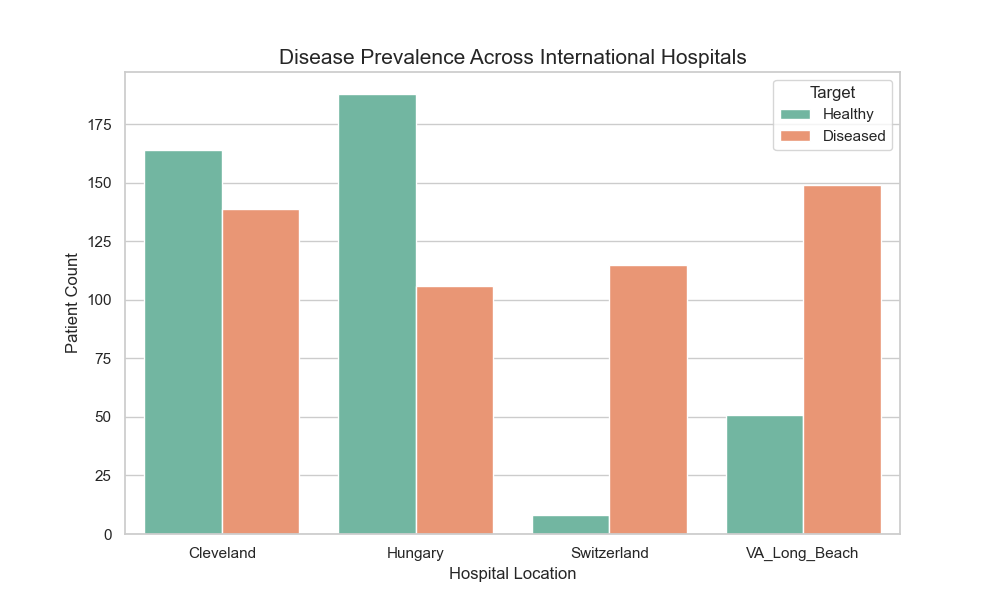
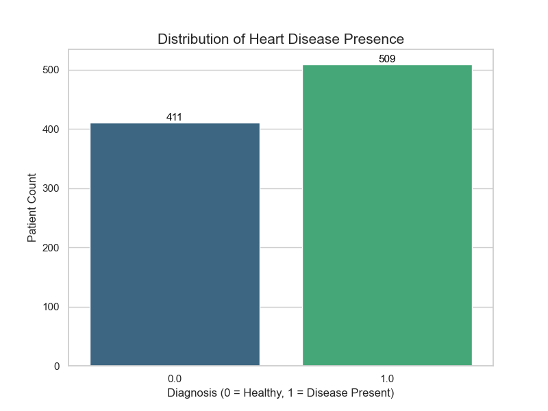
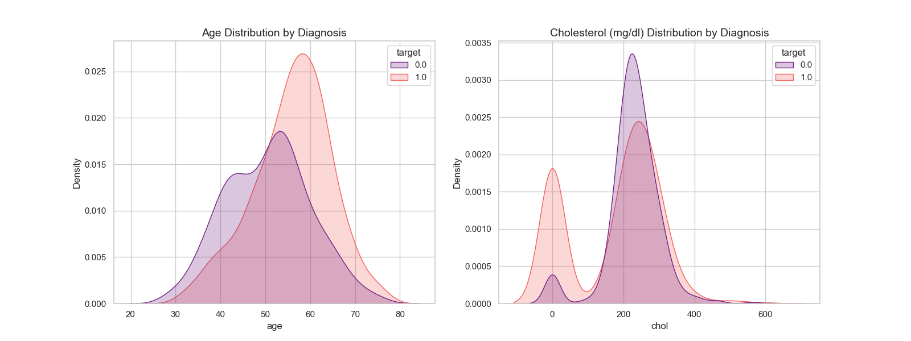
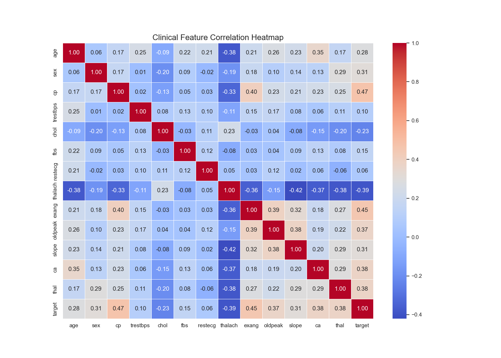
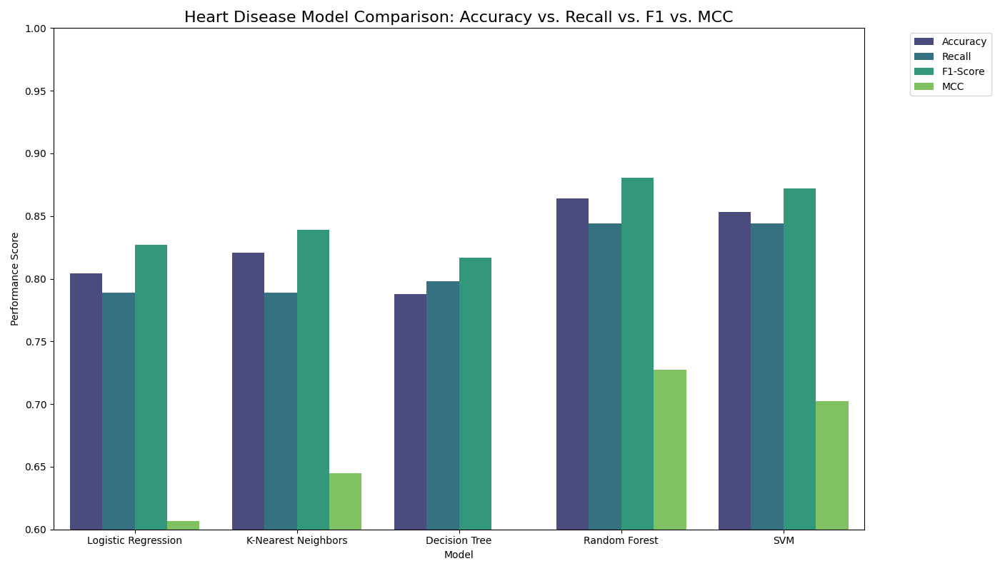
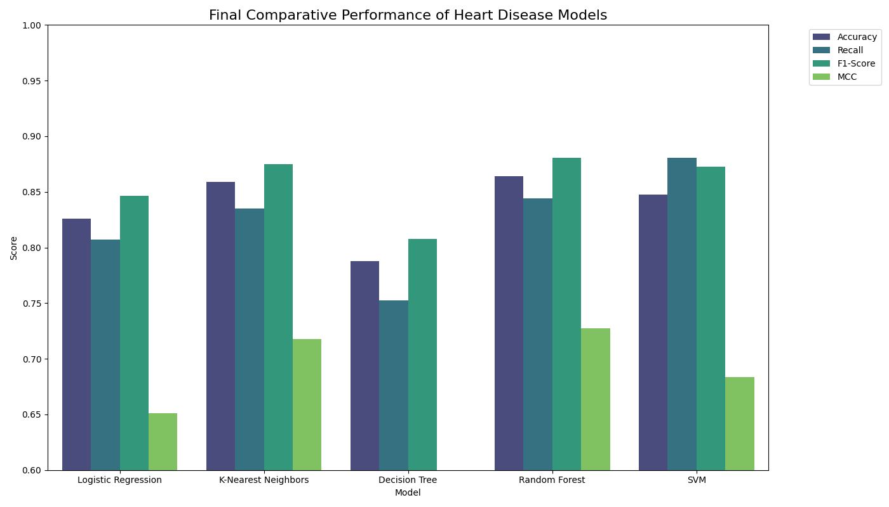
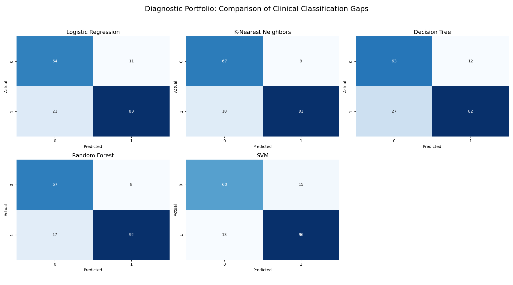
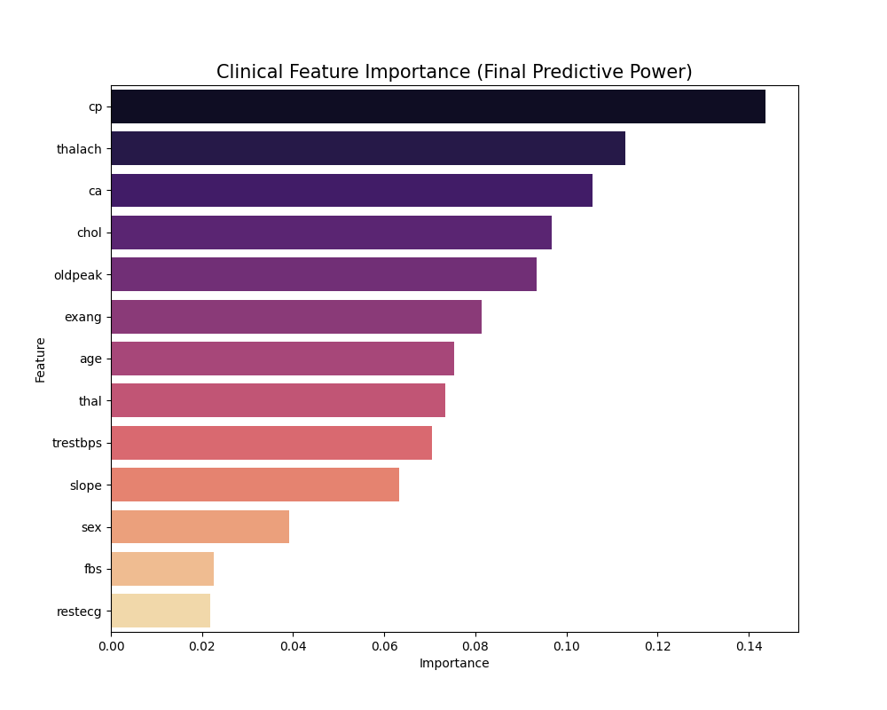

# Heart Disease Prediction: A Multi-Hospital Clinical Audit
### **Integrating Bioinformatics & Ensemble Learning for Cardiac Diagnostics**

* **Researcher:** Mirza Muhammad Hasan Ali
* **Course:** Applied Machine Learning
* **Status:** Final Robust Performance Audit

---

## 1. Introduction
Cardiovascular diseases remain the leading cause of global mortality. This project investigates the efficacy of machine learning algorithms—Logistic Regression, KNN, Decision Tree, Random Forest, and SVM—in identifying heart disease within an integrated multi-hospital dataset. 

The primary objective was to move beyond standard accuracy-based evaluations, conducting a rigorous clinical audit prioritized by **Matthews Correlation Coefficient (MCC)** and **Recall** to ensure maximum patient safety and model robustness. Through **5-Fold Cross-Validation** and **GridSearchCV** optimization, a robust diagnostic portfolio was developed, identifying the **Random Forest** as the most reliable auditor and the **SVM** as the primary screening tool for high-sensitivity environments.

---

## 2. Dataset Architecture: International Integration
Unlike single-center studies, this project utilizes the full scope of the UCI Heart Disease database to account for geographical and demographic variations in cardiac health.

* **Integrated Clinical Sites:** Cleveland (USA), Hungary, Switzerland, and VA Long Beach (USA).
* **Integrated Volume:** 920 total clinical records.
* **Predictive Attributes:** 13 clinical features categorized into Demographic (Age, Sex), Physiological (Blood Pressure, Cholesterol), Diagnostic (Chest Pain, Heart Rate), and Anatomical markers.

*Figure 1: Distribution of records and disease prevalence across the four international sites.*

---

## 3. Clinical Preprocessing & Feature Engineering
Medical data integrity is the cornerstone of clinical AI. Three advanced strategies were employed:

### 3.1 Label Binning & Medical Logic
The raw "Target" variable was binned into a binary state—0 (Healthy) and 1 (Diseased)—to prioritize primary screening utility. 

*Figure 2: Final balanced class distribution after binary encoding.*

### 3.2 Advanced KNN Imputation ($k=5$)
Conventional methods often discard incomplete rows, which would have resulted in the loss of 66% of this dataset. Instead, **K-Nearest Neighbors (KNN) Imputation** was used to fill gaps in features like `ca` (611 missing) and `thal` (486 missing) by analyzing similar patient profiles.

### 3.3 Feature Scaling & Initial Validation
* **StandardScaler:** Normalizes inputs to a mean of 0 and standard deviation of 1 to prevent high-scale features like Cholesterol from overpowering sensitive indicators like ST Depression.
* **80/20 Split:** An initial baseline was established using an 80% training and 20% validation split.

---

## 4. Exploratory Data Analysis (EDA)
* **Clinical Site Bias:** Cross-hospital analysis revealed that the Switzerland site primarily contributed diseased cases, while Cleveland and Hungary were more balanced.
* **The Cholesterol Artifact:** EDA identified a significant spike at **$0 \text{ mg/dl}$** in the Switzerland and VA data, identified as a recording artifact.
* **Correlation Analysis:** Strong correlations were found between **Chest Pain Type (`cp`)** and **Exercise Angina (`exang`)** with the disease state.

---

## 5. The Validation Journey: From Baseline to Robustness
A core feature of this project is the transition from initial discovery to robust scientific validation.

### Phase 4: Baseline Discovery (80/20 Split)
Initially, a standard 80/20 train-test split was utilized to establish a baseline. While this yielded high scores, it was susceptible to "optimism bias".

### Phase 5: Robust Clinical Audit (5-Fold Cross-Validation)
To ensure clinical reliability, we implemented **5-Fold Cross-Validation**. GridSearchCV was used to tune hyperparameters—such as $C$ and $gamma$ for SVM—maximizing the **F1-Score** for a balanced diagnostic output.

---

## 6. Results: The Final Performance Audit
The final models were ranked by **MCC**, the gold standard for clinical binary classification.

| Model | Accuracy | Recall (Safety) | F1-Score | MCC (Robustness) |
| :--- | :--- | :--- | :--- | :--- |
| **Random Forest** | **86.4%** | 84.4% | **0.880** | **0.727** |
| **K-Neighbors** | 85.8% | 83.4% | 0.875 | 0.717 |
| **SVM** | 80.9% | **88.0%** | 0.829 | 0.622 |
| **Logistic Reg.** | 82.6% | 80.7% | 0.846 | 0.651 |
| **Decision Tree** | 78.8% | 75.2% | 0.807 | 0.582 |

### Diagnostic Insights
* **The Champion (Random Forest):** Achieved the highest MCC ($0.727$), proving most reliable across multi-center data.
* **The Safety Net (SVM):** Achieved the highest Recall ($88\%$), minimizing "False Negatives" where a sick patient is incorrectly sent home.

---

## 7. Discussion: Feature Significance
The AI's diagnostic logic aligns with established cardiological guidelines. The model prioritized:
1. **Chest Pain Type (`cp`):** Primary physiological indicator of ischemia.
2. **Max Heart Rate (`thalach`):** Surrogate for cardiac output under stress.
3. **Major Vessels (`ca`):** Direct indicator of coronary artery disease.

---

## 8. Mathematical Audit Formulas
To evaluate clinical performance, the following mathematical metrics were utilized:

* **Accuracy:** Overall diagnostic correctness.
  $$Accuracy = \frac{TP + TN}{TP + TN + FP + FN}$$
* **Recall (Sensitivity):** Ability to catch all diseased cases (Primary Safety Metric).
  $$Recall = \frac{TP}{TP + FN}$$
* **MCC:** The most reliable clinical metric accounting for all four quadrants of the confusion matrix.
  $$MCC = \frac{TP \cdot TN - FP \cdot FN}{\sqrt{(TP + FP)(TP + FN)(TN + FP)(TN + FN)}}$$

---

## 9. Project Structure
* **`/Data`**: Contains the `heart_disease_cleaned.csv`.
* **`/Scripts`**: Phase 1 through Phase 6 Python scripts.
* **`/Visuals`**: High-resolution clinical plots and matrices.
* **`/Report`**: Final 8-page PDF clinical report.

### **Conclusion**
This study confirms that while multi-center medical data is often inconsistent and "noisy," ensemble machine learning—when combined with rigorous cross-validation—can extract universal cardiac risk patterns to support life-saving clinical decisions.
